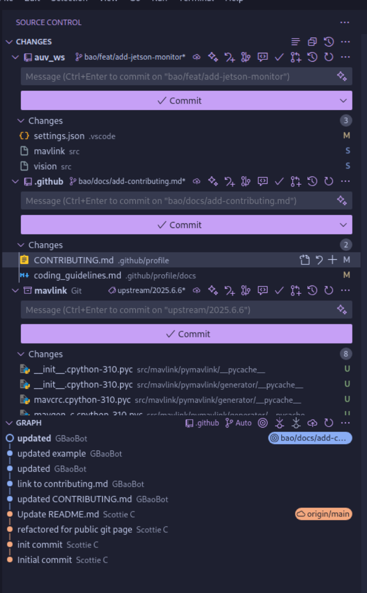

# Contributing

## Quick Start
- Please read our [short and sweet coding guidelines](./docs/coding_guidelines.md).
- Use [first contributions](https://github.com/firstcontributions/first-contributions) to practice making contributions just like other GitHub projects.

## Checklist
- Use same style and formatting as rest of code even if it's not your preferred one.
- Change any documentation that goes with code changes.
- Keep your pull request small, ideally under 10 files.
- Make sure you don't include large binary files.
- Rebase your branch frequently with main (once every 2-3 days is ideal).

## IMPORTANT NOTES

### 1. Always Use Pull Requests for Main Branch Changes

Never push changes directly to the main branch, regardless of your role. Follow this workflow:

1. Create a new feature branch from the main branch and develop your changes there. Use a clear, consistent naming format. Recommended format is `type/new-feature`, for example, `feat/develop-new-algorithm`. Each branch should focus on a single feature or change.
2. Push your branch and open a pull request (PR). The PR description should be clear and descriptive, explaining the purpose of the change and what has been modified. Resolve any conflicts with the main branch before requesting review. 
3. Request review from the code owner or designated reviewers
4. Before merging, merge the latest main branch into your feature branch and resolve any conflicts
5. Merge your feature branch into main with **SQUASH & MERGE** once all reviewers approve. This is to help the git history tree clean and easy to trace back

This applies to everyone, including code owners.

### 2. Make Changes in Git Submodules, Not the Workspace Root

If your work involves a Git Submodule, you must create and develop on a new branch in the appropriate **submodules**, not directly in the parent repository. Please practice with git submodules, or use `VSCode Git Extensions` to manage the git repository.

Each submodule has its own git history and should be managed independently. If you wish to git changes the parent repository, please discuss with leads or in-charge person to clarify before making changes.